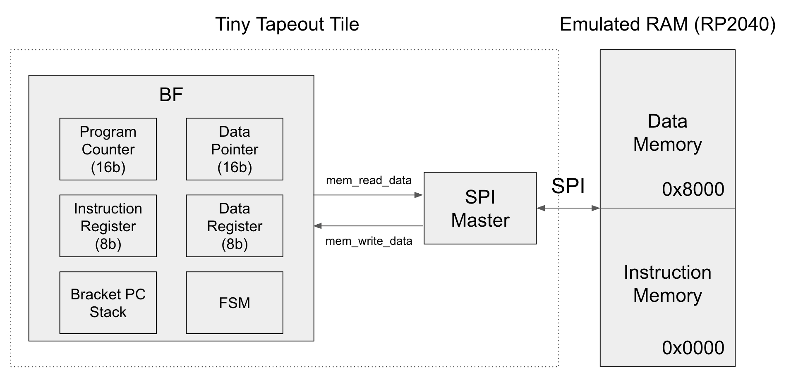

<!---

This file is used to generate your project datasheet. Please fill in the information below and delete any unused
sections.

You can also include images in this folder and reference them in the markdown. Each image must be less than
512 kb in size, and the combined size of all images must be less than 1 MB.
-->

## Block diagram

## How it works

This is a multicycle CPU that runs programs written in the [BF](https://en.wikipedia.org/wiki/Brainfuck)
(BF) language. BF has eight instructions operating on a tape of byte cells and a data pointer:
`>` `<` move the pointer, `+` `-` change the cell, `.` `,` do output/input, and `[` `]` form loops.

The design has no on-chip RAM. **Both the program and the data tape live off-chip in the RP2040's
emulated SPI RAM** (Michael Bell's `spi-ram-emu`, which behaves like a 23LC512: SPI mode 0, `0x03` read /
`0x02` write, 16-bit address). The chip reaches memory through an on-chip **SPI master**, so every
instruction performs at least one SPI transaction (arithmetic ops like `+` and `-` are a read-modify-write = two transactions).

Memory map (16-bit address): `0x0000–0x7FFF` is instruction memory, `0x8000–0xFFFF` is the data tape.

Blocks:
- **FSM (`bf`)** — fetch/decode/execute control, plus a hardware bracket stack for `[` `]` loops.
- **`spi_ram`** — adapter that turns each memory request into one SPI transaction.
- **`spi_master`** — generates SCLK/CS, shifts the 32-bit command/address/data frame.

## How to test

1. Connect the SPI pins (`uio[0..3]`) to an RP2040 running `spi-ram-emu`, which provides the 64 KB memory.
2. Load a BF program into instruction memory starting at address `0x0000`.
3. Hold `rst_n` low to reset, release it, then pulse **`start`** (`uio[4]`) high for at least one cycle.
4. The core runs the program, fetching instructions and operating on data entirely over SPI.

The repo's cocotb tests verify the design at multiple levels: the SPI master (`Makefile.spi`), the isolated BF FSM (`Makefile.bf`), and the full chip with a mock SPI RAM (`Makefile.top`).

## External hardware

An RP2040 (e.g. the Tiny Tapeout demo board) running `spi-ram-emu` to provide 64 KB of SPI RAM connected to
`uio[0..3]`.
